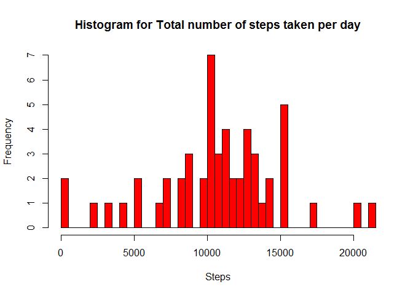
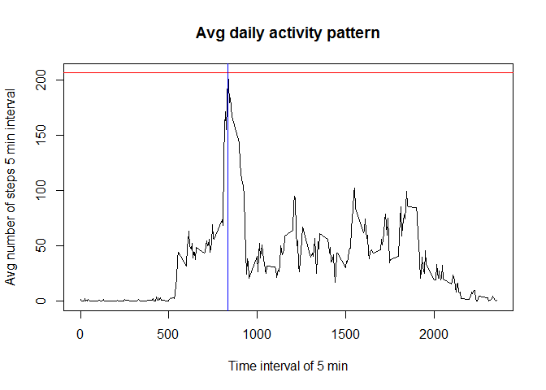
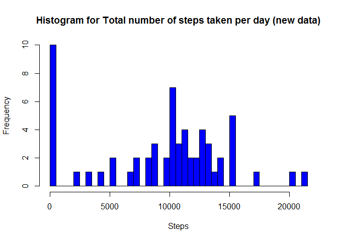

# Reproducible Research: Peer Assessment 1
Rohit Chaube  
Saturday, October 18, 2014  

This is an R Markdown document for Peer Assessments 1 for Reproducible Research Class - Oct 2014.


## Loading and preprocessing the data


```r
activity_data <- read.csv('activity.csv')
## activity_data_no_na <- activity_data[complete.cases(activity_data),]
summary(activity_data)
```

```
##      steps                date          interval     
##  Min.   :  0.00   2012-10-01:  288   Min.   :   0.0  
##  1st Qu.:  0.00   2012-10-02:  288   1st Qu.: 588.8  
##  Median :  0.00   2012-10-03:  288   Median :1177.5  
##  Mean   : 37.38   2012-10-04:  288   Mean   :1177.5  
##  3rd Qu.: 12.00   2012-10-05:  288   3rd Qu.:1766.2  
##  Max.   :806.00   2012-10-06:  288   Max.   :2355.0  
##  NA's   :2304     (Other)   :15840
```


## What is mean total number of steps taken per day?

Histogram of the total number of steps taken each day

```r
activity_data_by_date <- aggregate(. ~ date, data = activity_data, FUN=sum)
activity_data_by_date$date_num <- as.numeric(activity_data_by_date$date)
hist(activity_data_by_date$steps, breaks =50, col=c("red"), xlab ="Steps", ylab = "Frequency", main="Histogram for Total number of steps taken per day")
```

 

What is mean total number of steps taken per day?

```r
mean1 <- mean(activity_data_by_date$steps)
median1 <- median(activity_data_by_date$steps)
```

The mean and median total number of steps per day are 1.0766189\times 10^{4} and 10765 respectively.


## What is the average daily activity pattern?

Time series plot of the 5-minute interval (X-axis) and the avg number of steps taken across all days (Y-axis) is plotted using the following R-code 


```r
activity_data_avg_steps_daily <- aggregate(activity_data$steps, by = list(activity_data$interval), FUN=mean, na.rm = T)
colnames(activity_data_avg_steps_daily) <- c("intervals", "mean")

max.steps <- max(activity_data_avg_steps_daily$mean)
max.int <- activity_data_avg_steps_daily[activity_data_avg_steps_daily$mean==max(max.steps),1]

plot(activity_data_avg_steps_daily$intervals, activity_data_avg_steps_daily$mean, xlab = "Time interval of 5 min", ylab = "Avg number of steps 5 min interval", type = "l", main = "Avg daily activity pattern")


abline(h=max.steps, col = c("red"))
abline(v=max.int, col = c("blue"))
```

 

The maximum number of steps per interval is 206.1698113 and corresponds to the interval 835 


## Imputing missing values

1. Calculate and report the total number of missing values in the dataset (i.e. the total number of rows with NAs)


```r
 noofrows <- nrow(activity_data[is.na(activity_data$steps)==TRUE,])
```

There are 2304 rows with missing values

2. Filling up all the missing data set values with mean from the 5-min interval calculated in previous step


```r
## Copy original data into new dataframe
activity_data_new <- activity_data

## Copy the 5-min interval mean into all the missing values 
row.names(activity_data_avg_steps_daily) <- activity_data_avg_steps_daily$intervals
ind <- which(is.na(activity_data_new$steps))
activity_data_new[ind, 1] <- activity_data_new[as.factor(activity_data_new[ind,3]),2]
```

3. Create a new dataset that is equal to the original dataset but with the missing data filled in.

```r
head(activity_data_new)
```

```
##   steps       date interval
## 1     1 2012-10-01        0
## 2     1 2012-10-01        5
## 3     1 2012-10-01       10
## 4     1 2012-10-01       15
## 5     1 2012-10-01       20
## 6     1 2012-10-01       25
```

4.1 Make a histogram of the total number of steps taken each day


```r
activity_data_new_by_date <- aggregate(. ~ date, data = activity_data_new, FUN=sum)
hist(activity_data_new_by_date$steps, breaks=50, col=c("blue"), xlab ="Steps", ylab = "Frequency", main="Histogram for Total number of steps taken per day (new data)")
```

 


4.2 Calculate and report the mean and median total number of steps taken per day.

```r
mean(activity_data_new_by_date$steps)
```

```
## [1] 9392
```

```r
median(activity_data_new_by_date$steps)
```

```
## [1] 10395
```

## Are there differences in activity patterns between weekdays and weekends?

First we need to get the day information for the corresponding date given in the activity_data


```r
day_col <- weekdays(as.Date(activity_data_new$date))
day_col <- ifelse(day_col %in% c("Saturday","Sunday"), yes = "weekend", "weekday")
```

Saturday and Sunday are assigned as weekends and rest of the days as weekday
 

```r
x <- aggregate.data.frame(activity_data_new$steps, by = list(activity_data_new$interval, day_col), FUN = mean, na.rm = T)
colnames(x) <- c("interval", "daytype", "steps")
```

Panel plot containing a time series plot (i.e. type = "l") of the 5-minute interval (x-axis) and the average number of steps taken, averaged across all weekday days or weekend days (y-axis).


```r
library(ggplot2)
ggplot(data=x, aes(x=interval, y=steps, group=daytype)) + geom_line(aes(color=daytype)) + facet_wrap(~ daytype, nrow=2)
```

 

